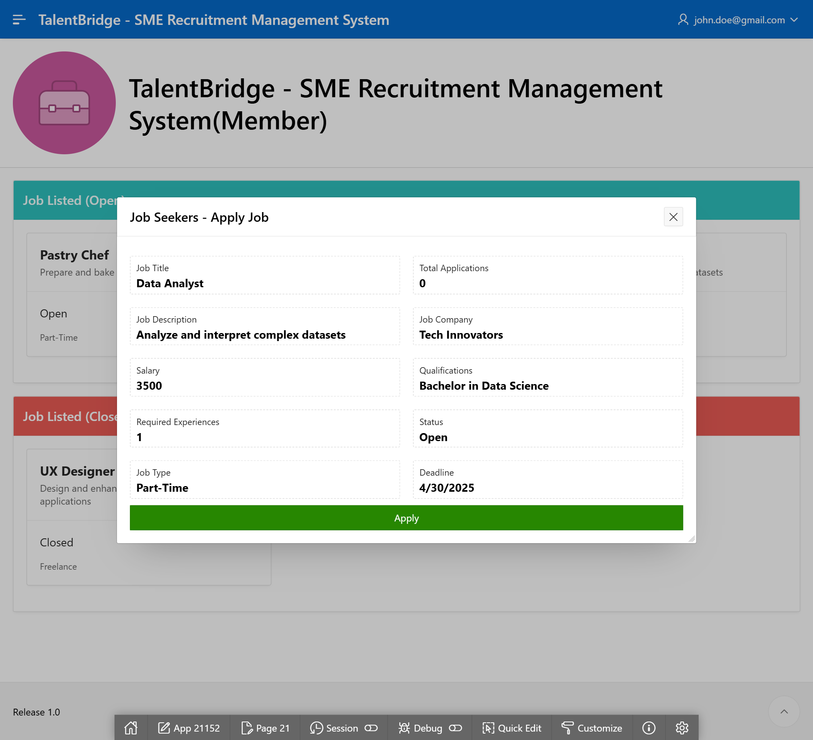

# TalentBridge

**TalentBridge** is a database project developed using Oracle APEX and SQL, designed to streamline and manage talent acquisition processes.

<h2 id="preview">🖥️ GUI Preview</h2>

Below are some previews of the TalentBridge GUI developed using Oracle APEX:

Admin

*Admin homepage showing total users (company and job seekers) and job listed (open and closed).*

Company

*Dashboard showing job posted and reporting overview for company.*

Job Seeker

*Job applications for job seekers.*

<h2 id="module">📌 Project Modules</h2>

TalentBridge consists of the following modules:

- **Job Listing**: Enables companies to create and manage job postings.
- **Company Profile**: Provides company details and allows organizations to maintain their profiles.
- **Application Tracking**: Allows admins to oversee and manage job applications.
- **Job Seeker Module**: Enables job seekers to search and apply for jobs.

<h2 id="techs">🛠️ Technologies Used</h2>

- **Oracle APEX**: For building the web-based application interface.
- **PL/SQL**: Backend logic and database procedures.
- **SQL**: Data manipulation and querying.

<h2 id="license"> 📜 License</h2>

This project is licensed under the MIT License. See the [LICENSE](LICENSE) file for details.

<h2 id="teams"> 👥 Team Members</h2>

- **[Your Name]** - Project Lead
- **[Contributor 1]** - Database Design & Implementation
- **[Contributor 2]** - Oracle APEX Development
- **[Contributor 3]** - SQL Queries & Optimization

